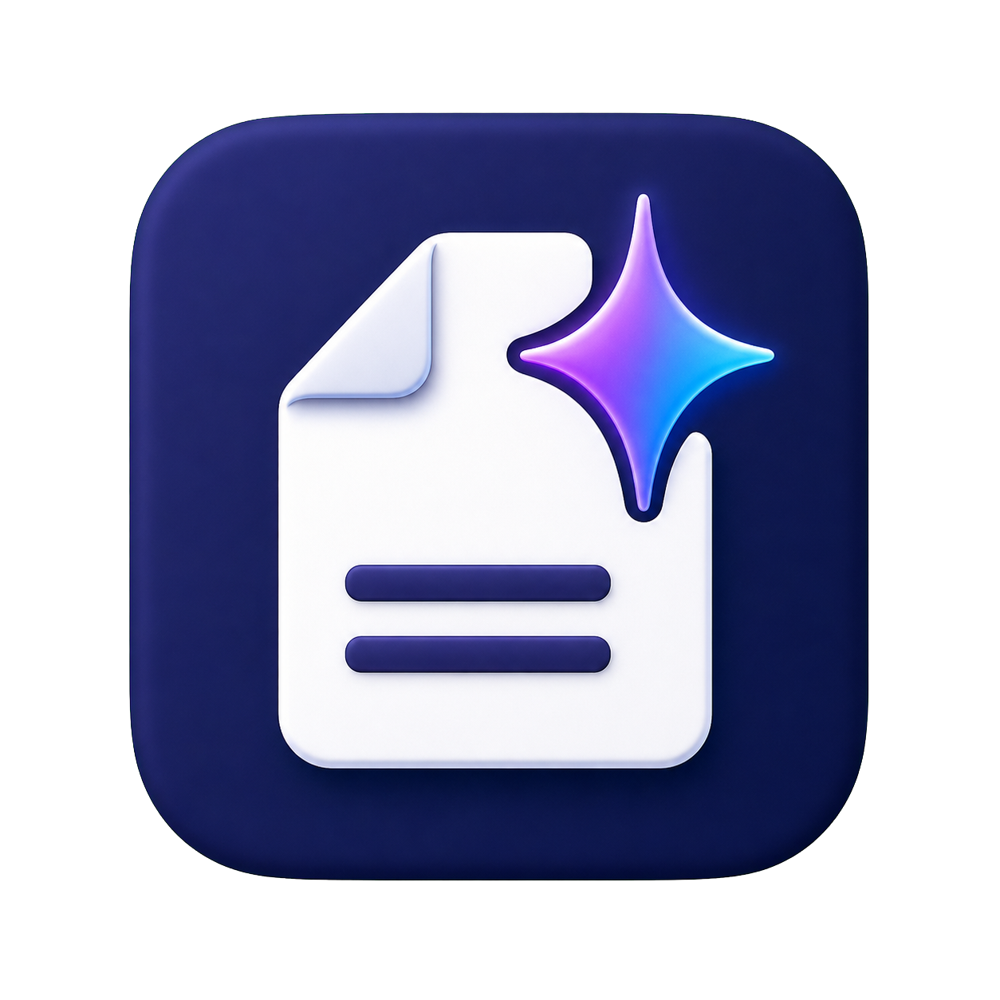
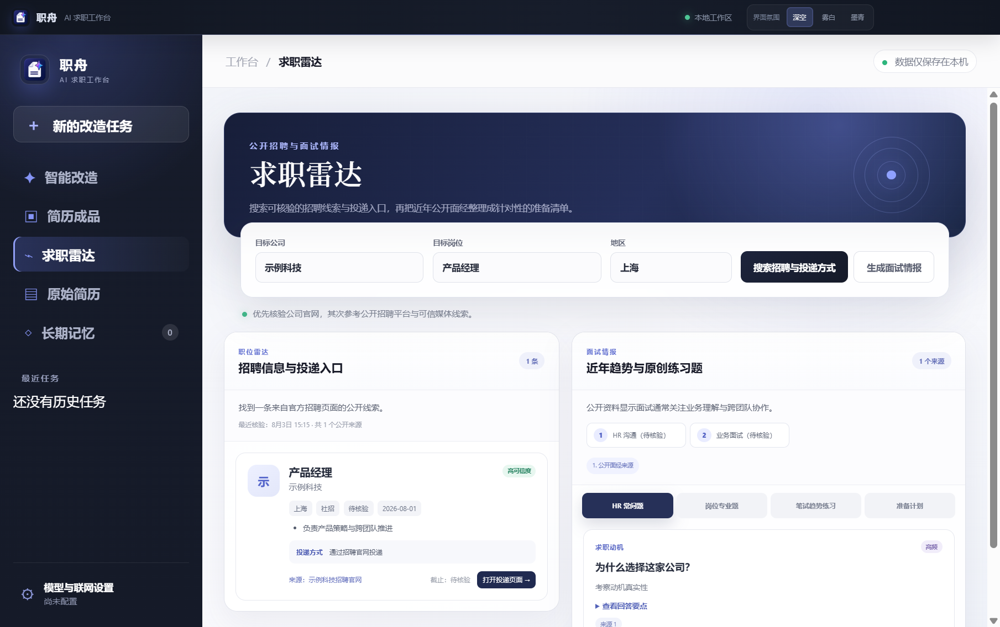
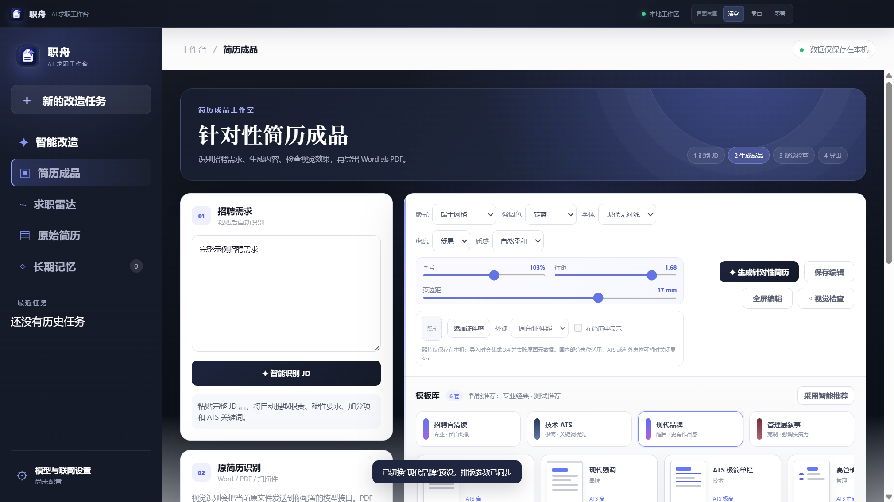

<p align="center">
  
</p>

<h1 align="center">职舟</h1>

<p align="center"><strong>从一份简历，到理想上岸。</strong></p>

<p align="center">
  一款本地优先、自带模型接口的 Windows AI 求职工作台。<br />
  把简历改造、职位搜索、面试准备和成品导出放进同一个桌面应用。
</p>

<p align="center">
  
  
  
  
  <a href="https://github.com/Laity1m/ZhiZhou/releases/latest"></a>
</p>

## 产品预览

### 求职雷达

搜索可核验的公开招聘线索和投递入口，并把近年公开面试信息整理成针对性的准备清单。



### 简历成品工作室

从招聘需求识别、内容生成、视觉检查到 Word/PDF 导出，所有步骤集中在一套可调节的成品工作流中。



> 截图中的人物、公司、岗位和招聘信息均为自动化测试生成的虚构示例，不包含真实用户数据。

## 职舟能做什么

| 模块 | 能力 |
| --- | --- |
| 智能改造 | 结合原始简历、目标公司、岗位和长期记忆进行多轮诊断与改写，禁止凭空虚构经历 |
| JD 识别 | 从粘贴的招聘需求中提取公司、岗位、职责、硬性要求、加分项与 ATS 关键词 |
| 文件理解 | 本地解析 PDF、DOCX、TXT、Markdown、RTF，并自动识别 Word/PDF 内嵌证件照；可选视觉模型识别扫描件、定位扁平化照片和检查原版式 |
| 简历工作室 | 工作区直接上传或更换原简历，自动同步识别到的照片；十套 A4 模板及字号、行距、页边距、字体与配色即时调整 |
| 全屏编辑 | 独立的 Word 式编辑界面，支持段落样式、撤销重做、列表、格式调整和自动保存 |
| 成品导出 | 导出可编辑 DOCX 或所见即所得 PDF |
| 求职雷达 | 按公司、岗位和地区检索公开招聘信息，优先公司官网并保留来源、时间与投递入口 |
| 面试情报 | 汇总近年公开面经中的 HR 关注点、岗位问题与可能流程，生成带来源的回答框架 |
| 原创练习 | 根据公开岗位趋势生成分级笔试练习与准备计划，不收集泄露或保密真题 |
| 自带 AI | 支持 OpenAI 兼容 Chat Completions、Responses API、常见中转站 SSE/NDJSON 响应 |
| 联网搜索 | 支持 Tavily，Responses 模式下也可使用原生 `web_search` |

## 设计特点

- 原创粒子开屏、环境动效和分阶段导入/生成动画。
- 深空、雾白、墨青三套界面氛围。
- 模板预设一键切换，排版参数即时反馈。
- 识别到的照片可自动同步到成品，并在“智能填满／完整显示”之间切换，支持 75%–130% 外观框大小微调。
- 全窗口成品展示和自适应小窗口布局。
- API Key 通过 Electron `safeStorage` 使用 Windows 系统能力加密。
- 简历、聊天、记忆和设置默认只保存在本机。
- Word/PDF 中可分离的内嵌照片在本机提取、筛选和裁切，无需调用 AI。

## 下载与使用

[前往 Releases 下载最新版 Windows 安装包](https://github.com/Laity1m/ZhiZhou/releases/latest)。首次启动后，打开左下角“模型与联网设置”。

### 工作区上传与照片同步

1. 进入“简历成品”，在“原简历识别”卡片中直接上传 PDF、DOCX 或其他支持格式。
2. 普通 Word/PDF 会在本机解析文字并筛选内嵌证件照，识别成功后立即同步到成品；扫描版 PDF 可再点击“视觉识别原简历”。
3. 在照片工具栏选择“智能填满”或“完整显示”，并使用 75%–130% 大小滑杆调整外观框。
4. 设置会同步用于工作区预览、全屏成品、Word 与 PDF 导出。

### AI 设置

1. 选择 `Chat Completions` 或 `Responses`。
2. 填写 API 地址、模型名称和 API Key。
3. 点击“测试连接”，确认接口返回正常后保存。
4. 如需扫描件识别或版式检查，可单独填写视觉模型；留空时使用主模型。

职舟兼容遵循 OpenAI 接口结构的官方服务、本地模型和中转服务，但无法保证任意私有协议都可直接接入。

### 联网设置

- 普通兼容接口：推荐选择 Tavily，并填写单独申请的 Tavily API Key。
- OpenAI Responses：也可以选择原生 `web_search`。
- 不需要联网时：保持“关闭联网”，简历编辑与本地功能仍可使用。

## 本地开发

需要 Node.js 20 或更新版本，以及 pnpm。

```powershell
git clone https://github.com/Laity1m/ZhiZhou.git
cd ZhiZhou
pnpm install
pnpm start
```

运行检查：

```powershell
pnpm run check
pnpm test
```

构建 Windows 安装包：

```powershell
pnpm run build:win
```

安装包输出到 `release` 目录。

## 项目结构

```text
assets/                     应用图标
electron/                   Electron 主进程、预加载、文件与导出工作流
src/                        桌面界面、样式和渲染逻辑
tests/                      单元测试与 Electron 窗口回归测试
docs/screenshots/           脱敏产品截图
THIRD_PARTY_NOTICES.md      第三方项目与设计研究说明
```

## 数据与隐私

职舟不提供公共后端，也不代管用户的 AI 密钥或简历。数据默认写入 Electron 的 Windows `userData` 目录。

- 调用 AI 时，完成请求所需的简历、求职目标、记忆和对话会发送给用户自行配置的 AI 服务。
- 启用联网时，搜索问题会发送给用户选择的 Tavily 或 Responses 原生搜索服务。
- 无指定公司且检索远程岗位时，岗位关键词可能发送给 Jobicy 公开 API。
- 只有用户主动使用视觉识别时，原文件或临时 PDF 才会发送给所配置的视觉模型；扫描版 PDF 的照片位置可由模型判断，但页面渲染与照片裁切仍在本机完成。
- 提交 Issue 时请勿上传真实简历、API Key、聊天记录或个人联系方式。

更多安全说明见 [SECURITY.md](./SECURITY.md)。

## 信息边界

- 招聘状态、截止日期和投递方式可能随时变化，使用前应回到原招聘页面核验。
- 公开面经属于个人经历，不代表公司当前固定流程。
- “原创练习”是基于公开趋势生成的训练材料，不是命中承诺，也不是公司在用真题。
- 项目不提供绕过招聘平台限制、抓取私有数据或传播保密试题的功能。

## 参与贡献

欢迎提交 Issue 和 Pull Request。开始前请阅读 [CONTRIBUTING.md](./CONTRIBUTING.md)。

## 开源研究与致谢

模板与工作流研究参考了 [Reactive Resume](https://github.com/AmruthPillai/Reactive-Resume)、[RenderCV](https://github.com/rendercv/rendercv)、[Resume Matcher](https://github.com/srbhr/Resume-Matcher)、[Tech Interview Handbook](https://github.com/yangshun/tech-interview-handbook) 和 [Jobicy Remote Jobs API](https://github.com/Jobicy/remote-jobs-api) 等公开项目。文档图片读取使用 [Mammoth.js](https://github.com/mwilliamson/mammoth.js/) 与 [Mozilla PDF.js](https://github.com/mozilla/pdf.js) 的公开接口。

本项目的桌面界面、中文模板、交互动画和导出实现均为项目内原创代码。完整说明见 [THIRD_PARTY_NOTICES.md](./THIRD_PARTY_NOTICES.md)。

## License

[MIT](./LICENSE) © 2026 职舟 contributors
